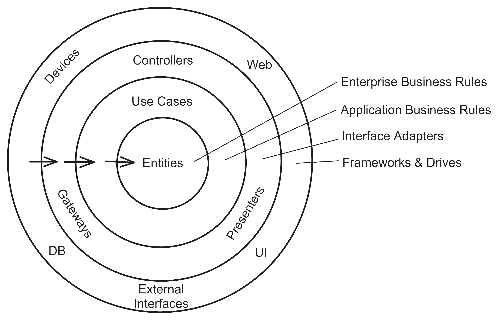
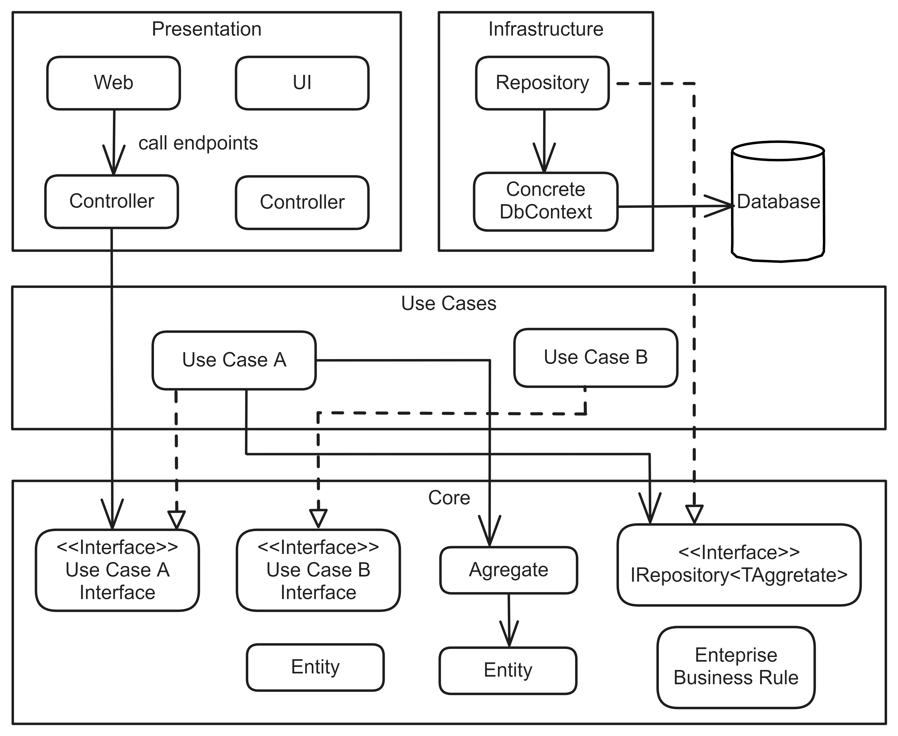
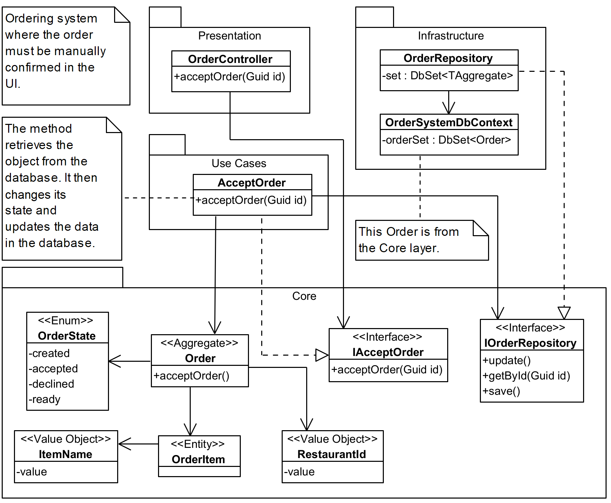

# Clean Architecture
## Pattern Description
The Clean Architecture [^1] is an architecture pattern that aims to achieve a separation of concerns. It consists of layers arranged in a way that the resulting system is independent of the database, user interface, and external systems. Clean Architecture is based on Domain-Driven Design [^2].

The advantage of this architecture is the ease of replacing the database, the user interface framework, or changing the external framework for another. This is due to the fact that the system is not dependent on them. It is easier to test and maintain thanks to the separation of concerns and direction of dependencies. Nevertheless, this pattern also introduces more complex code, which could potentially lead to performance issues.

## Topology
The Clean Architecture consists of the Entities layer, Use Cases layer, Interface Adapter layers and Frameworks \& Drives layer. The layers are shown in the Figure 1. Communication is represented by arrows.

**Figure 1:** Clean Architecture layers and their communication [^1].

**Entities** The Entities layer contains the definition of domain objects that contain data and business logic. These models are created using Domain-Driven Design [^3].

**Use Cases** The Use Cases layer includes the implementation of entry classes for all system use cases.

**Interface Adapters** The Interface Adapters layer contains adapters to convert data from the format for the Use Cases layer and Entities layer to a format suitable for a database or user interface.

**Frameworks \& Drives** The Frameworks \& Drives layer typically contains a database and a user interface.

The direction of dependencies is important in this architecture. They can only point inwards. So a layer cannot depend on an outer layer. The number of layers is not strictly given, only the correct flow of dependencies must be maintained.

In Figure 2 and Figure 3, the layers are more consistent with the practice. The Entity layer also contains all the interfaces and is then called the Core layer. The Interface Adapters layer and the Frameworks \& Drives layer are grouped into separate layers. The Presentation layer typically contains controllers and the definition of the user interface. The Infrastructure layer contains classes for database access or external frameworks.

The user interface is capable of calling any endpoints. The specified controller then calls the method of the corresponding use case. This changes the data in the corresponding entities. This flow is illustrated in Figure 2.

**Figure 2:** Detailed view of Clean Architecture layers.

Figure 3 illustrates a sample food ordering system utilizing Clean Architecture. It depicts the scenario of a manual order confirmation, which then invokes the *acceptOrder* endpoint. This method invokes a method in the *IAcceptOrder* interface, whose definition is located within the Core layer. The implementation of this interface is situated within the Use Case layer, which in turn makes use of the *IOrderRepository* interface to modify the data within the database.

**Figure 3:** An example of Clean Architecture captured in a class diagram.

## Clean Architecture in Industry
In industry, Clean Architecture is less understood than Layered Architecture. This is because the design of Clean Architecture does not start with the design of the database as in Layered Architecture but with Domain-Driven design [^3]. System design is frequently taught from the perspective of the database. Consequently, it is difficult to alter this way of thinking. And that is where many mistakes come from.

Often attempts are made to map this architecture onto a Layered Architecture because it is difficult to determine what belongs in which layer. For example, the methods for accessing data in a database are in a different layer from the entity \cite{learning_domain_driven_design} definition for which the data is stored. In a Layered Architecture, they are both in the same layer.

It also fails to design entities [^3] and aggregates [^3] well. For example, when designing an e-commerce store, in the Layered Architecture, a single class would be created for the product that contains all the information. In the context of Clean Architecture, separate entities for the product in the shopping cart, the product in the catalog, and the product in a warehouse would be created, because each contains different information. It is often a mistake to have only one entity for a product in Clean Architecture.

In practice, there is also the opinion that Clean Architecture, Onion Architecture and Hexagonal Architecture are essentially the same, sharing the same underlying idea but being visualized differently.

In industry, the different layers may have different names. The Entities layer is also called the Domain layer. If it also contains interfaces, the name Core layer is used. The Use Cases layer may also be called the Application layer. The Interface Adapters layer and Frameworks \& Drives layer are grouped in a single layer called Infrastructure.

## References
[^1]: MARTIN, Robert C. Clean Architecture: A Craftsman’s Guide to Software Structure and Design. Prentice Hall, 2017. isbn 978-0-13- 449416-6.
[^2]: SCOTT MILLETT, Nick Tune. Patterns, Principles, and Practices of Domain-Driven Design. Wiley, 2015. isbn 9781118714690.
[^3]: KHONONOV, Vlad. Learning Domain-Driven Design: Aligning Software Architecture and Business Strategy. O’Reilly Media, 2021. isbn 978-1-098-100100.