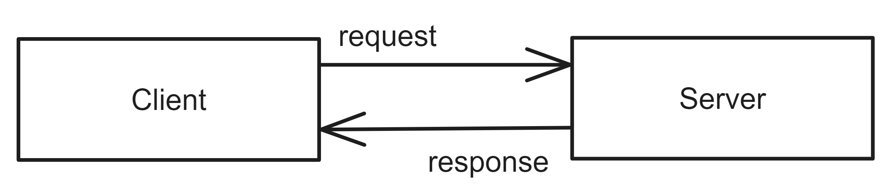

# Client-Server Architecture

## Pattern Description
The Client-Server Architecture [^1] separates the server from individual clients, with the server offering services that clients can use.

This pattern enables the provision of the same functionality to multiple clients, which can be easily added. A server can scale, but it can also represent a single point of failure.
## Topology
The Client-Server Architecture comprises two components: the client and the server. Figure 1 displays their communication.

**Figure 1**: The components of Client-Server Architecture.

**Client** The client accesses the server and uses its services. Communication is initiated using the request/response protocol.

**Server** The server provides services that are accessed by the client. It does not initiate communication with clients. It only responds to their requests. 

When a client requires a service from the server, it initiates communication by sending a request. The server then responds with the requested data. The server does not have any information about individual clients and only responds to requests. This makes it easy to add more clients.

## References
[^1]: LEN BASS Paul Clements, Rick Kazman. Software Architecture in Practice. 3rd ed. Pearson Education, 2013. isbn 978-0-321-81573-6.

