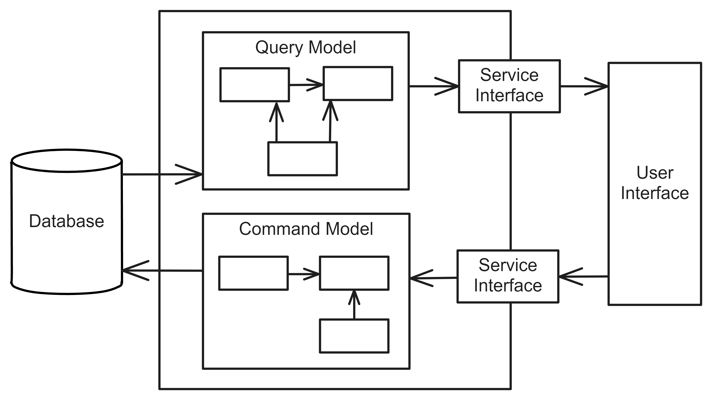

# Command Query Responsibility Segregation
## Pattern Description
The Command Query Responsibility Segregation (CQRS) [^1] [^2] pattern separates read and write data models. The use of concatenated models is suitable for basic CRUD operations [^3]. However, for more complex applications, this approach is no longer appropriate. For instance, in more complex scenarios, not all information in a given model may be filled in, but is needed for the opposite operation.

By separating the models, the application can optimize read and write operations, achieving better scalability and performance. However, this pattern can add complexity, especially if separate databases are used for reads and writes, which requires addressing eventual consistency.

## Topology
The Command Query Reponsibility Segregation utilizes commands for writing data and queries for reading data. The use of separate models for commands and queries is illustrated in Figure 1.

**Figure 1:** Models segregation in Command Query Responsibility Segregation [^2].

**Command** The command represents an action that alters the state of the system and, consequently, the data in the database.

**Query** The query is an operation used to retrieve data from the system. It should not be used for data modification.

**Command models** The command models are utilised for writing to the database and may include validation logic.

**Query models** The query models are designed to retrieve data from a database.

Figure 2 illustrates the system interaction in greater detail. Separate services are created to execute commands and queries, each using distinct models to retrieve or modify data. Separate databases can also be used for writing and reading. When changes are made to the write database, an event is triggered to synchronize the data in the read database. A write database may contain classic tables for the storage of data. In some cases, an Event Sourcing pattern [^4] is employed, whereby the events that have resulted in changes to the data are stored alongside the data itself. The read database, in contrast, typically comprises materialized views [^5].

**Figure 2:** Detailed view on Command Query Responsibility Segregation.

## References
[^1]: KHONONOV, Vlad. Learning Domain-Driven Design: Aligning Software Architecture and Business Strategy. O’Reilly Media, 2021. isbn 978-1-098-100100.

[^2]: FOWLER, Martin. CQRS [online]. 2011-07-14. [visited on 2024-05-13]. Available from: https://martinfowler.com/bliki/CQRS.html?ref=blog.funda.nl.

[^3]: CRUD (create, read, update and delete) - definition & overview [online]. [visited on 2024-05-10]. Available from: https://www.sumologic.com/glossary/crud/.

[^4]: NEWMAN, Sam. Building Microservices: Designing Fine-grained Systems. O’Reilly Media, 2021. isbn 9781492034025.

[^5]: Materialized View pattern [online]. Microsoft [visited on 2024-05-10]. Available from: https://learn.microsoft.com/en-us/azure/architecture/patterns/materialized-view.
