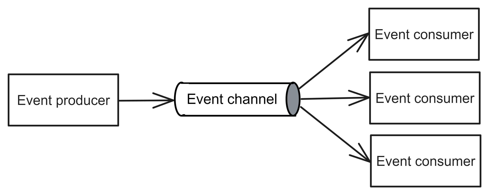
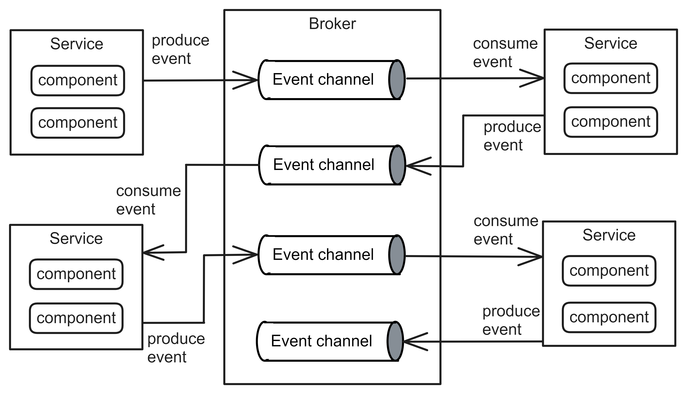
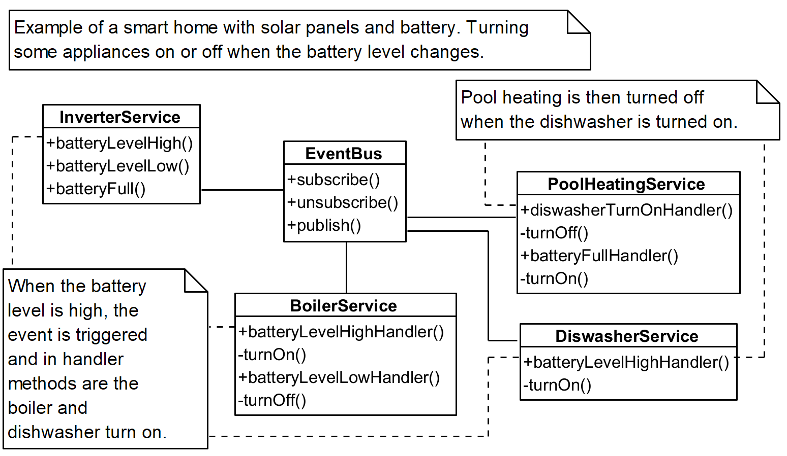
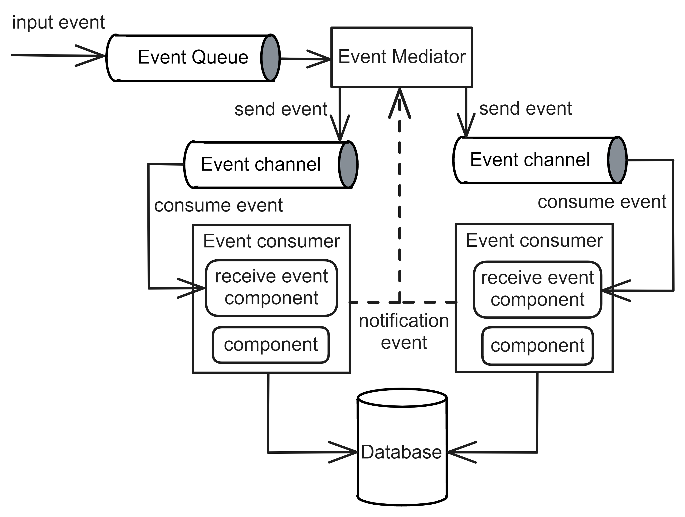

# Event Driven Architecture
## Pattern Description
The Event-Driven Architecture [^1] [^2] is a distributed and asynchronous architecture. It is based on the asynchronous processing of an input event, which is decomposed into several others that are processed sequentially. This architecture is often combined with other patterns.

This pattern offers good scalability, extensibility and fault tolerance. However, it has some drawbacks, including difficult testing, expensive development, and complexity. The primary cause of this is the non-deterministic flow of data through the system.

## Topology
The Event-Driven Architecture comprises of services and event channels. Services can be referred to as either an event producer or an event consumer, depending on whether the service produces or consumes an event. Figure 1 illustrates the basic event flow.

**Figure 1:** The components of Event-Driven Architecture.

**Service** The service is deployed separately and performs specific functions. Its granularity is not predetermined and may vary. A service processes received events and often notifies the rest of the system of its processing with another event.

**Event channel** The event channel stores triggered events and delivers them to the appropriate servers.

The specific topology of Event-Driven Architecture can vary, but typically Broker or Mediator topologies are used.

### Broker Topology
In Broker topology, the entire system responds to the initial event that enters it. The service serves the event, and the service informs the rest of the system of its processing by another event. Zero to n services can respond to this event. The service creating the event does not know which services are interested in this event. It is best practice to raise the event, even if no one is servicing it because it provides a good place for easy extensibility of the system. If no one responds to the event, it is removed from the channel after a certain amount of time. Figure 2 shows part of this flow.

**Figure 2:** Detailed view on Broker topology [^1].

Figure 3 shows a sample class diagram. This is an example of a Smart home system in which appliances are turned off and on based on events sent. Services communicate with each other via the Event Bus, which enables them to subscribe to specific events. The initial event is produced by the *InverterService*, which reports the battery level. This event is delivered to the *BoilerService* and *DiswasherService* which handle this event via Event Bus. The *batteryLevelHighHandler* methods subsequently invoke the *turnOn* methods, which is a private method. Both services notify the rest of the system of the action performed, and the *PoolHeatingService* can respond to turning on the washer by turning off the heating.

**Figure 3:** An example of Event-Driven Architecture captured in a class diagram.

### Mediator Topology
The Mediator topology is based on the Mediator pattern [^3], which is classified as a design pattern.

The Mediator topology comprises the Event Mediator, a central component. When an initial event is received, it is stored in an Event Queue. The Event Mediator then receives the events and raises the corresponding events for the uniform services involved in processing the event. The invoked events are subsequently stored in the Event channels of the given service. After processing, they only inform the Event Mediator that the service was successful. Unlike Broker topology, they do not inform the entire system. The topology is illustrated in Figure 4.

**Figure 4:** Detailed view on Mediator topology [^1].

## Event-Driven Architecture in Industry
Event-Driven Architecture is frequently used in the design of banking or large systems. Systems with this architectural style frequently result in a tightly coupled system. Attempts are also made to emulate REST API on Event-Driven Architecture. However, this may result in a loss of the benefits.

In practice, the term service most commonly refers to service. To distinguish whether a service event produces or consumes, the terms consumer and producer are used.

Apache Kafka [^4] is a popular choice for inter-service communication due to its effectiveness, but it can be resource-intensive. Other methods for implementing communication are specific. In some cases, companies may develop their own solutions, but this can be challenging and may not be the best approach. Implementing own communication system can be challenging.

## References
[^1]: MARK RICHARDS, Neal Ford. Fundamentals of Software Architecture: An Engineering Approach. 1st ed. O’Reilly Media, Inc., 2020. isbn 978-1-492-04345-4.

[^2]: FOWLER, Martin. Patterns of Enterprise Application Architecture. 1st ed. Addison-Wesley, 2002. isbn 0-321-12742-0.

[^3]: GAMMA, E.; HELM, R.; JOHNSON, R.; VLISSIDES, J. Design Patterns: Elements of Reusable Object-Oriented Software. AddisonWesley, 1995. Addison-Wesley professional computing series. isbn 9783827328243.

[^4]: APACHE KAFKA [online]. 2023-07-11. [visited on 2024-05-13]. Available from: https://kafka.apache.org/.