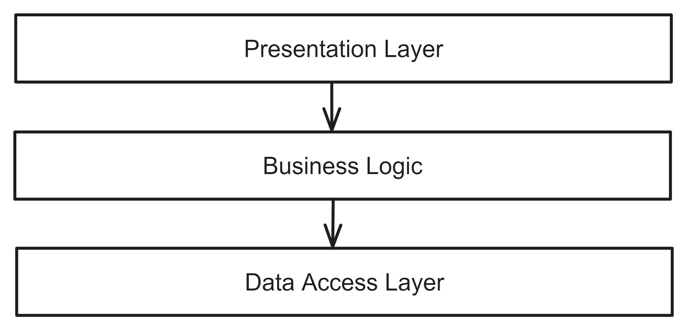
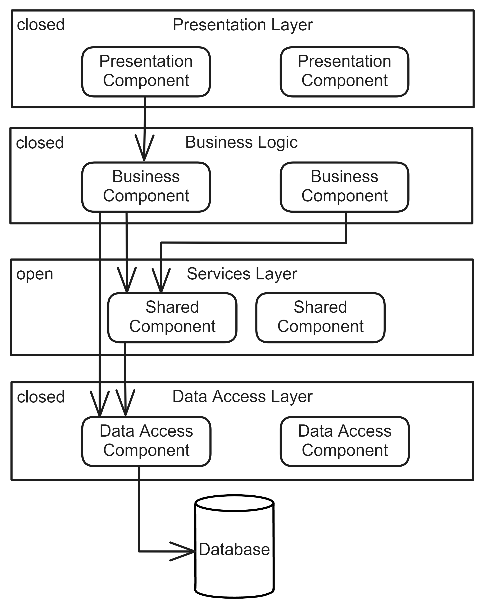

# Layered Architecture

## Pattern Description
The Layered Architecture [^1][^2] is a widely recognized and well-understood software architecture. It comprises multiple horizontal layers, with each layer addressing one of the following technical concerns: interaction with the consumers, implementing business logic, and persisting the data [^2].
This architectural approach offers the advantages of monolithic architectures without the need to address the challenges typically associated with distributed systems. However, this pattern may not always be suitable. For instance, this pattern does not provide the advantages of distributed architectures, such as good scalability.

## Topology
The Layered Architecture comprises multiple horizontal layers, each utilizing the functionality of the layer beneath it while providing functionality to the layer above. Although the number of layers is not strictly limited, the most common structure is a presentation layer, a business layer and a data access layer. Figure 1 illustrates the layers and their dependencies.

**Figure 1:** Typical layers of Layered Architecture.

**Presentation Layer** The presentation layer is responsible for displaying data to the user and contains the user event handlers. It also validates the user's inputs.

**Business Layer** The business layer encompasses the business logic of the system.

**Data Access Layer** The data access layer is comprised of classes that define access to persistence mechanisms [^2]. It may also be referred to as the persistence layer.

Layered Architecture follows the concept of Layers of Isolation [^1]. This means that a modification in one layer should not impact other layers, as long as the layer interface remains unchanged. This also enables the replacement of a particular layer with a new one.

The layers can be either closed or open. If a layer is closed, the request cannot skip it. This is only possible if the layer is open.

Figure 2 displays the open and closed layers, as well as the potential request flow. The service layer, marked as open, is the only layer that a request can bypass. This layer may include auxiliary or shared functionalities for individual business components.

**Figure 2:** An example of open and closed layers.
## References
[^1]: MARK RICHARDS, Neal Ford. Fundamentals of Software Architecture: An Engineering Approach. 1st ed. O’Reilly Media, Inc., 2020. isbn 978-1-492-04345-4.
[^2]: KHONONOV, Vlad. Learning Domain-Driven Design: Aligning Software Architecture and Business Strategy. O’Reilly Media, 2021. isbn 978-1-098-100100.