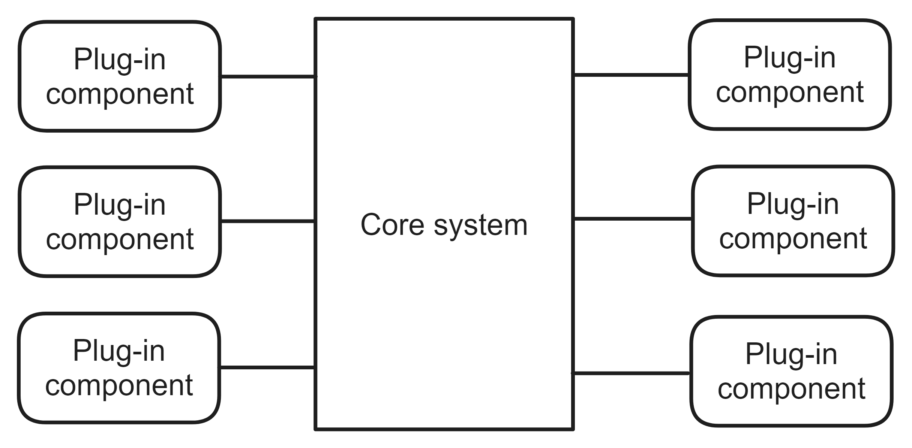
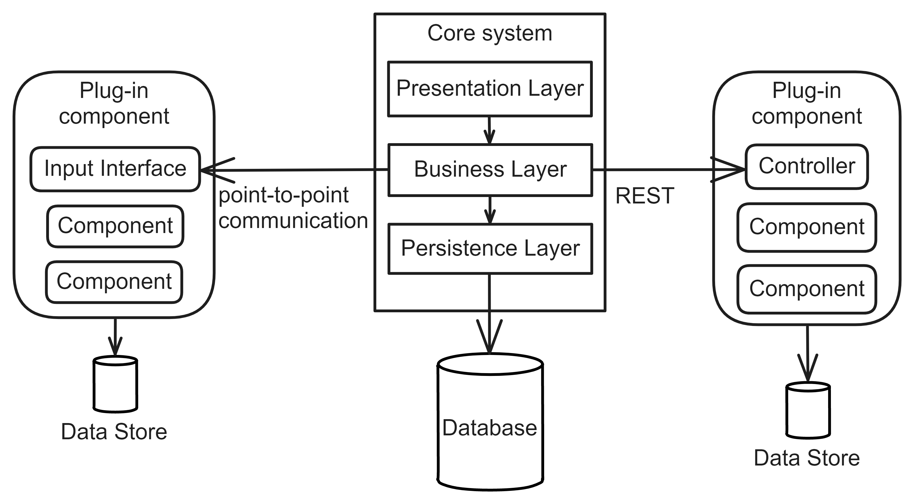

# Microkernel Architecture
# Pattern Description
The Microkernel Architecture [^1][^2] focuses on creating a system whose basic functionality is freely extensible. It is typically used for applications that provide basic functionality that can be extended by installing additional extensions. Typically these are development environments or web browsers.

The system architecture allows for easy extensibility with additional functionality, but its development is costly and the resulting system is not easily scalable. Furthermore, the core system may act as a bottleneck due to the fact that all requests are routed through it.

## Topology
The Microkernel Architecture comprises two types of components: the core system and the plug-in components, as illustrated in Figure 1.

**Figure 1:** The components of Microkernel Architecture [^1].

**Core system** The core system comprises the fundamental functionality of the resulting system, which can be expanded with additional features provided by plug-in components.

**Plug-in components** Plug-in components are independent modules that offer additional specialized functionality to the core system. Each plug-in component is self-contained and does not rely on any other component.

The core system includes a registry for plug-ins that stores information on how to communicate with each individual component. These components can be integrated into the system in various ways, such as through a separate library, code in a different namespace within the same codebase, or as a remote service. An example of communication is shown in Figure 2. The plug-in component deployed as a remote service is communicated via the REST API [^4], while point-to-point communication is used with the component as a separate library.

The core system can be implemented using either the Layer Architecture or a Modular Monolith [^3], as well as individual plug-in components. Figure 2 illustrates the use of both methods.

**Figure 2:** Detailed view on Microkernel Architecture topology.

## References
[^1]: MARK RICHARDS, Neal Ford. Fundamentals of Software Architecture: An Engineering Approach. 1st ed. O’Reilly Media, Inc., 2020. isbn 978-1-492-04345-4.
[^2]: BUSCHMANN, Frank. Patten-Oriented Software Architecture: A System of Patterns. 1st ed. Wiley, 1996. isbn 0-471-95869-7.
[^3]: NEWMAN, Sam. Building Microservices: Designing Fine-grained Systems. O’Reilly Media, 2021. isbn 9781492034025.
[^4]: What is a REST API? \[online\]. IBM, 2023-07-11 \[visited on 2024- 05-13\]. Available from: https://www.ibm.com/topics/restapis.