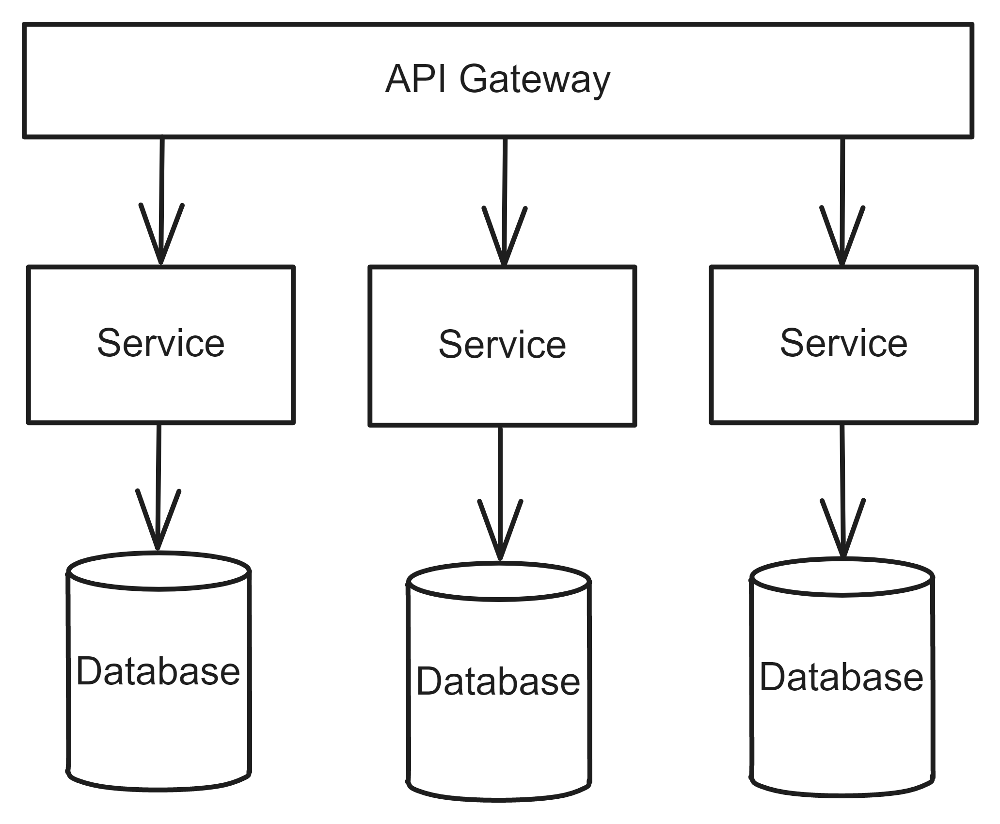
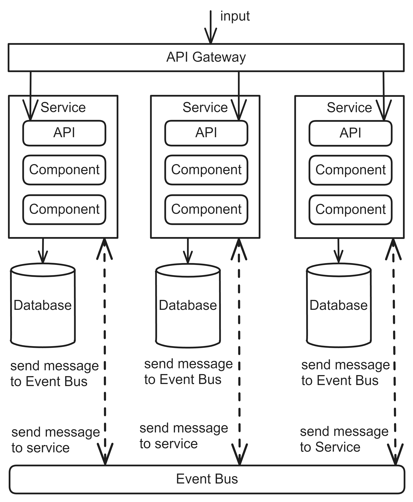
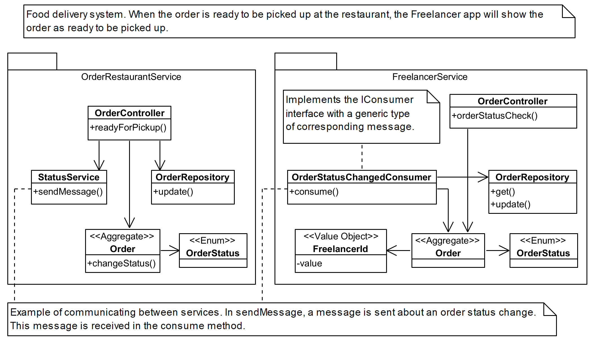

# Microservices
## Pattern Description
The Microservices [^1] are one of the most popular architectural patterns today. It is a distributed architecture consisting of many services, each of which contains its database. Its design is based on Domain-Driven design [^2].

It is very difficult to design a system with this architecture. If it can be done well, the resulting system is well scalable, agile, testable and fault-tolerant. If the design is poor, a Distributed Monolith [^2] is created. The resulting system then loses the benefits of Microservices.

## Topology
The Microservice architecture consists of many services, typically accessed through an API Gateway, as illustrated in Figure 1.

**Figure 1:** The components of Microservices.

**Service** Each service is single-purpose and deployed separately. Each contains its own database. Only the service accesses the data in that database. This concept is called bounded context [^1].

**API Gateway** API Gateway is used to communicate with individual services. It allows to hide the location and API of individual services. It can also implement measurement of various metrics or security.

The user interface communicates only with the API Gateway, which in turn communicates with the individual services. Individual services communicate with each other only through synchronous or asynchronous communication via messages. Each service subscribes to receive messages from another service. This avoids unwanted dependencies between services. The appearance of these dependencies would subsequently lead to an antipattern called a Distributed Monolith [^2]. Messaging communication is shown in the Figure 2.

**Figure 2:** Microservices with messaging communication.

A variety of design patterns are frequently employed in Microservices, including the Sidecar pattern [^3], Service mesh pattern [^3], Circuit Breaker pattern [^4], Saga pattern [^4], and Event Sourcing pattern [^4].

The advantage of Microservices is that if a service is unavailable, the resulting system can continue to operate in a limited mode. Only the relevant functionality is unavailable. If the resulting system becomes a Distributed Monolith [^2], it loses these advantages. For example, if there is one service in the system on which all the others depend, then if it is down, the whole system is down.

Figure 3 illustrates a class diagram, which demonstrates the architecture of two services within the food delivery system. To communicate between the services, RabbitMq [^5] can be employed, with the implementation of classes that send and consume messages informing about data changes. When a restaurant marks an order as ready for pick-up in the UI, the endpoint *readyForPickUp* in *OrderController* is called. This method modifies the data in the database and in the *StatusService* transmits a message indicating that the order has been prepared. This message is received by the *OrderStatusChangedConsumer* class, which updates the database. This update is then visible to the Freelancer in the application.

**Figure 3:** An example of Microservices captured in a class diagram.

## Microservices in Industry
In industry, systems with Microservices are designed in the same way as Layered Architecture. This is because the design of Clean Architecture does not start with the design of the database as in Layered Architecture but with Domain-Driven design [^2]. This leads to an incorrect design of the entities [^2] that contain all the information. As a result, this data cannot be correctly distributed to the services. Dependencies are then created between the services that need this data. The architecture of such a system then leads to a Distributed Monolith [^2]. However, such a system loses all the benefits of Microservices. In industry, the use of a Service Mesh [^3] pattern often leads to a Distributed Monolith. The most common problem in industry is the occurrence of such dependencies between services.

Unwanted dependencies can also occur if an inappropriate method is chosen to obtain data from another service. Often data is obtained by querying the service, which adds another dependency. Sometimes data is retrieved directly from the database of the service. In this case, however, the bounded context [^1] is violated. There may also be batch retrieval of data from the database.

Other problems in practice include solving timeouts by adding retry logic. The correct approach is to use the Circuit breaker pattern [^4]. It is also possible to encounter systems that do not version the API and then have to add back. Often a REST API is used for the API, then the problem of dealing with asynchronous communication arises.  There are also cases where the services designed are too granular.

## References
[^1]: MARK RICHARDS, Neal Ford. Fundamentals of Software Architecture: An Engineering Approach. 1st ed. O’Reilly Media, Inc., 2020. isbn 978-1-492-04345-4.

[^2]: KHONONOV, Vlad. Learning Domain-Driven Design: Aligning Software Architecture and Business Strategy. O’Reilly Media, 2021. isbn 978-1-098-100100.

[^3]: NEAL FORD Mark Richards, et. al. Software Architecture: The Hard Parts: Modern Trade-Off Analyses for Distributed Architectures. 1st ed. O’Reilly Media, Inc., 2021. isbn 978-1-492-08689-5.

[^4]: NEWMAN, Sam. Building Microservices: Designing Fine-grained Systems. O’Reilly Media, 2021. isbn 9781492034025.

[^5]: RabbitMQ [online]. [visited on 2024-05-10]. Available from: https://www.rabbitmq.com/.