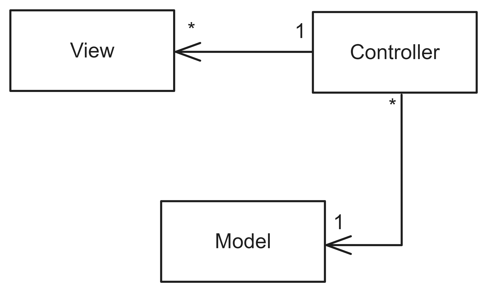
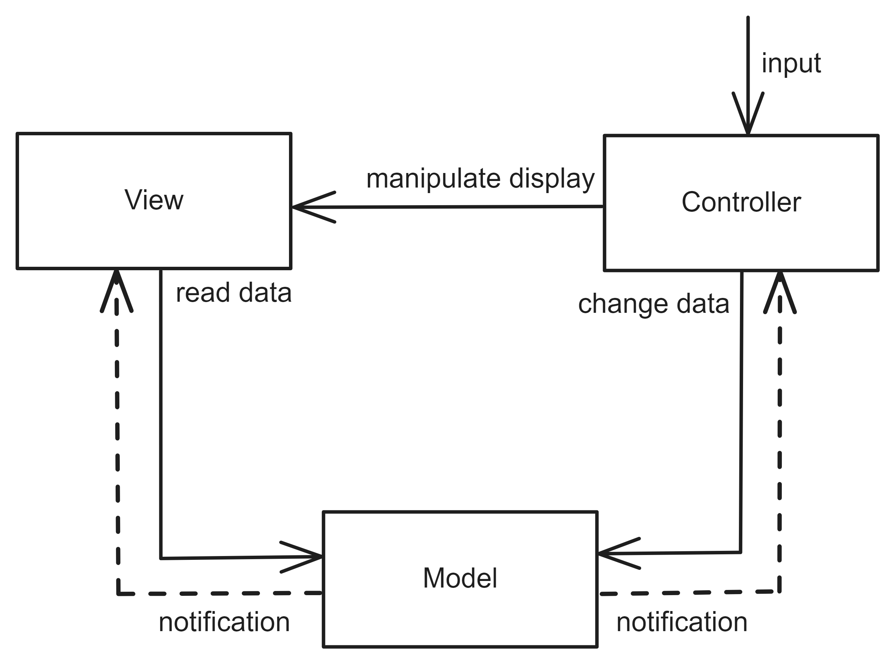
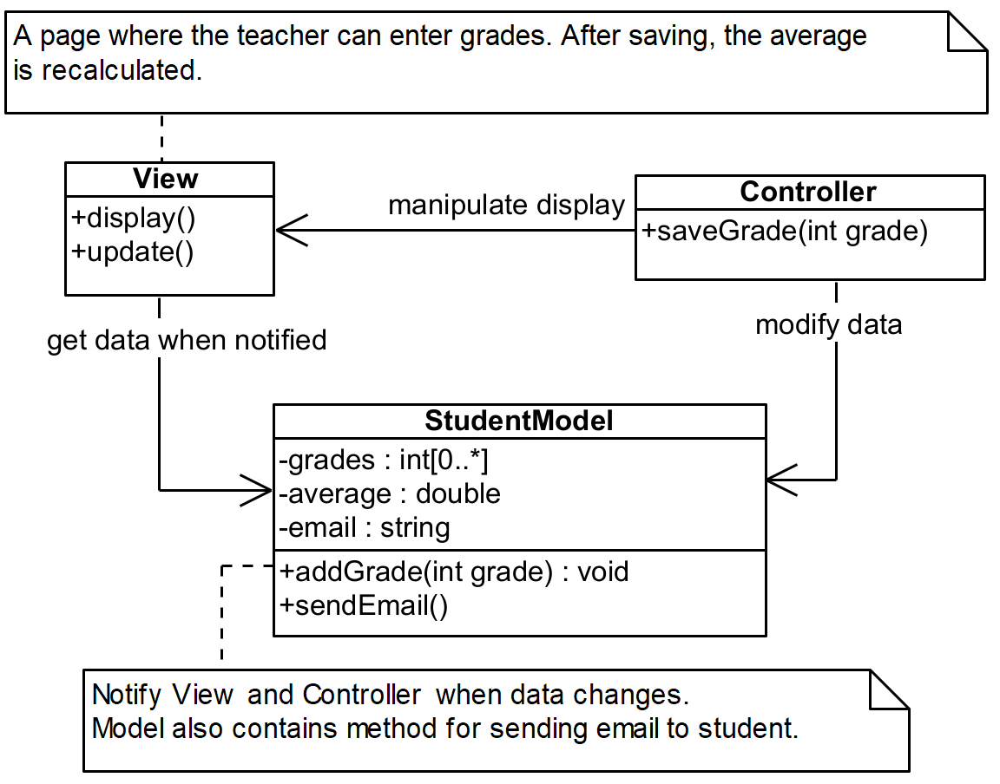

# Model-View-Controller

## Pattern Description
The Model-View-Controller (MVC) [^1] architecture is one of the most well-known. This pattern enables the separation of data definition and presentation. It is commonly used in developing graphical user interface applications, particularly in web development.

Separating data presentation from definition allows data to be presented to the user in multiple ways, while the domain data remains unchanged. The popularity of the pattern stems from its ability to facilitate frequent changes to the user interface, which is known to change more frequently than domain data. Thus, one advantage of using visual representations of data is the ability to modify them without altering the underlying data structure. One disadvantage of this pattern is that the details of the pattern may vary across different sources.

## Topology
The Model-View-Controller architecture comprises three components: the Model, the View, and the Controller. Figure 1 displays the relationships between them.

**Figure 1:** The components of Model-View-Controller.

**Model** The Model contains data and business logic. This data represent information from a specific domain.

**View** The data of the Model are presented to the user in the View. It consists of various user interface components. The View can also be a web page. Its purpose is to display data from the corresponding Model.

**Controller** The Controller receives inputs and manipulates the Model to change its data accordingly. It also determines which View to present to the user based on this manipulation. The Controller serves as an intermediary between the View and the Model, permitting them to remain decoupled.

When the user interacts with the View, the View does not directly modify the data in the Model. Instead, this input is received by the Controller, which then interacts with the corresponding Model and can modify the data in it. The Controller may select other Views to display to the user or update the same View with new data. Figure 2 illustrates this interaction. The Model utilizes the publish-subscribe pattern [^2], to notify the View and Controller of any data changes. Thus, the binding between the View and Model is solely for this purpose.

**Figure 2:** The communication of the components of Model-View-Controller.

Figure 3 illustrates an example of Model-View-Controller in a class diagram representing a simple page where the teacher inputs grades for a student. Upon saving the entered grade, the average is recalculated and the corresponding view is updated.

**Figure 3:** An example of the Model-View-Controller captured in a class diagram.

## Model-View-Controller in Industry
As the Model-View-Controller is based on the Layered Architecture, the Open-Closed principle [^4] highlights issues that frequently arise in industry. In real systems, there may also be various dependencies that are not permitted. Circular dependencies often occur. Specifically, there may be dependencies between components that violate the Open-Closed principle. It is possible to encounter situations where the View directly manipulates the Model.

In practice, there is often an incorrect placement of business logic within the Controller, which should be located within the Model.

The Model is also a database model. When used directly in a View, the corresponding Views must also be modified when the database model is altered. To improve maintainability, an additional component is often added, analogous to the Anti-Corruption Layer concept [^3]. This component is called a ViewModel or Data Transfer Object. This ViewModel is distinct from the ViewModel defined in the Model-View-ViewModel. The ViewModel represents a subset of data from one or more Models, which in turn uses the View and displays its data.

## References
[^1]: FRANK BUSCHMANN, et. al. Pattern-Oriented Software Architecture: A System of Patterns. 1st ed. WILEY, 1996. isbn 0-471-95869-7.
[^2]: Publisher-Subscriber pattern \[online\]. Microsoft \[visited on 2024- 05-10\]. Available from: https://learn.microsoft.com/en-us/azure/architecture/patterns/publisher-subscriber.
[^3]: Anti-corruption Layer pattern \[online\]. Microsoft \[visited on 2024- 05-10\]. Available from: https://learn.microsoft.com/en-us/azure/architecture/patterns/anti-corruption-layer.
[^4]: MARK RICHARDS, Neal Ford. Fundamentals of Software Architecture: An Engineering Approach. 1st ed. O’Reilly Media, Inc., 2020. isbn 978-1-492-04345-4.