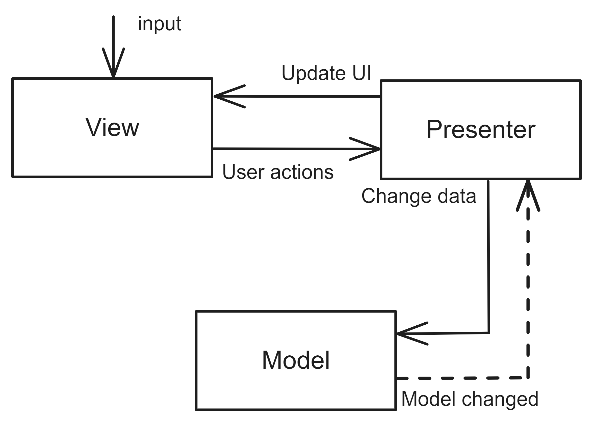

# Model-View-Presenter

## Pattern Description
The Model-View-Presenter (MVP) [^1] pattern represents a variation of the Model-View-Controller pattern. In this variation, the presenter assumes a role analogous to that of the Controller, although with some notable distinctions. Namely, the Presenter is responsible for all presentation logic and is also closely bound to a specific View.

Furthermore, the utilisation of the View and Presenter interfaces also facilitates the conduct of tests. Due to its complexity, the use of this pattern may not be appropriate for the creation of small applications.

## Topology
The Model-View-Presenter pattern comprises three components: the Model, the View, and the Presenter. Figure 1 illustrates the dependencies between these components.

**Figure 1:** The components of Model-View-Presenter.

**Model** The Model contains data and business logic. It then triggers data change notifications after changes are made to its data.

**View** The View is responsible for defining the user interface and displaying the data to the user. If the user makes a change in the user interface, the View will raise an event that handles the Presenter.

**Presenter** The Presenter interacts with the View and Model. It handles events from the View, modifies data in the Model and also updates the View.

If the user performs an action in the View, the View raises an event that is handled by the corresponding Presenter. Based on this, the Presenter modifies the data in the Model in accordance with the user's input. The Model then notifies all Presenters of the data change. The Presenter then updates the View. This interaction is illustrated in Figure 2.

In contrast to the Model-View-Controller pattern, the View and Presenter are more closely linked. The input is also received by the View, rather than the Controller. Furthermore, the View does not interact with the Model directly.

**Figure 2:** Detailed view of component interaction.

Other variations of this pattern can also be encountered. The variant depicted in Figure 2 is designated as the Passive View [^2]. If there would be interaction between the View and the Model, but solely for the purpose of receiving notifications of data changes in the Model, this variant is designated as the Supervising Controller [^3]. In this case, the data binding [^4] concept is employed to retrieve data.

## References
[^1]: INGENO, Joseph. Software Architect’s Handbook: Become a successful software architect by implementing effective architecture concepts. Packt Publishing, 2018. isbn 9781788627672.
[^2]: FOWLER, Martin. GUI Architectures \[online\]. 2006-07-18. \[visited on 2024-05-19\]. Available from: https://martinfowler.com/eaaDev/uiArchs.html.
[^3]: FOWLER, Martin. Supervising Controller \[online]. 2006-06-19. \[visited on 2024-05-19\]. Available from: https://martinfowler.com/eaaDev/SupervisingPresenter.html.
[^4]: STONIS, Michael. Enterprise Application Patterns using .NET MAUI. 1st ed. 2020.