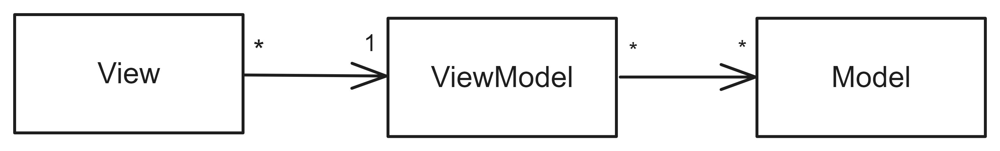
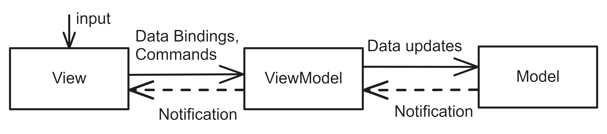
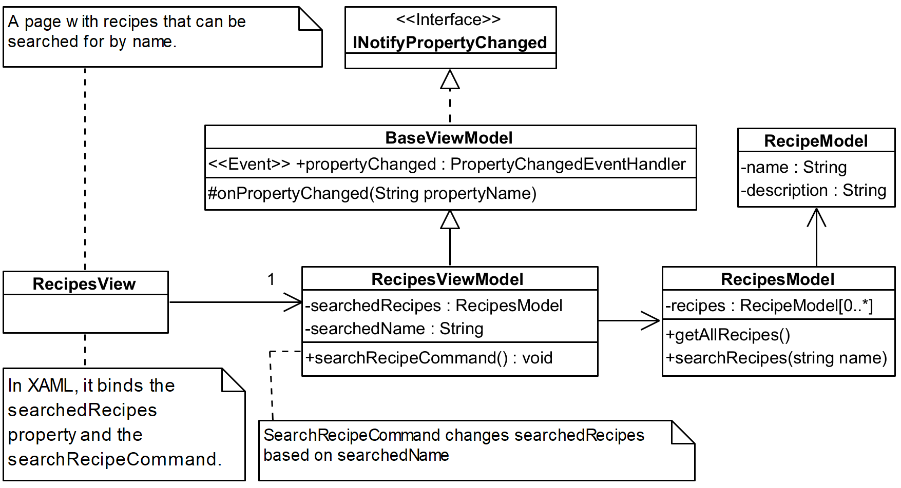

# Model-View-ViewModel

## Pattern Description
The Model-View-ViewModel (MVVM) [^1][^2] architecture is a variation of the Model-View-Controller. Its purpose is to separate the presentation and business logic.

This separation improves testability and maintainability and facilitates the replacement of one view with another. This architectural approach may be a complex solution for relatively simple applications.

## Topology
The Model-View-ViewModel architecture consists of three components: the View, the ViewModel, and the Model. Figure 1 displays the relationships between them.

**Figure 1:** The components of Model-View-ViewModel.

**View** The View encapsulates the user interface (UI) and UI logic [^2]. It contains the definition of the components of the graphical user interface. It is defined using a declarative language such as XAML. The View does not contain any business logic and only interacts with the ViewModel.

**ViewModel** The ViewModel encapsulates presentation logic and its state [^2]. The ViewModel facilitates the transfer of data from Models to View. This data can be retrieved by the View through the use of data binding [^2]. ViewModel is independent of how the data is presented to the user. It retrieves data from one or more Models, which may be in a different format than that contained in the ViewModel. Therefore, the ViewModel can perform data conversions from multiple Models. Additionally, the ViewModel implements commands, which are functions used to process events in the View. These commands permit the View to request data manipulation in the Model via the ViewModel.

**Model** The Model encapsulates business logic and data [^2]. It also contains validation logic.

The View, the ViewModel, and the Model communicate with each other in such a way that the View communicates with the ViewModel and the ViewModel communicates with the Model. The Model is unaware of which ViewModel is communicating with it, and the ViewModel is unaware of which View is interacting with it. The Model has no knowledge of which View represents its data. Their communication is illustrated in Figure 2.

**Figure 2:** The communication between Model-View-ViewModel components.

The View and the ViewModel communicate through the data binding concept [^2]. When a View binds a property in the ViewModel and that value changes, the View is notified of the change without having to repeatedly ask if the value has changed. Additionally, the View can utilize commands implemented in the ViewModel.

The Model-View-ViewModel is a more specific pattern than the Model-View-Controller pattern. However, it is possible to incorporate the idea of MVVM into MVC by adding Data Transfer Objects (DTO) [^3] to represent a subset of the data from the Models. Additionally, the ViewModel in MVVM contains commands, which can be seen as functions in the Controller in MVC.

Figure 3 illustrates an example of the Model-View-ViewModel pattern in the form of a class diagram. It depicts a page that displays a list of recipes and a search box. Upon the user entering a search query, the *searchRecipeCommand* is invoked, which stores the search result in the *searchedRecipes* property. The *RecipesViewModel* class is derived from the *BaseViewModel* class, which implements the *INotifyPropertyChanged* interface. This enables the *RecipesViewModel* class to raise a change event when the *searchedRecipes* property changes. The *RecipesView* class is then informed of the change, after which it displays the retrieved recipes to the user.

**Figure 3:** An example of Model-View-ViewModel captured in class diagram.
## Model-View-ViewModel in Industry
A common violation in practice is the direct storage of a reference to the Model in the View, without the use of the ViewModel. In many cases, business logic is often contained in ViewModels, rather than in Models.
## References
[^1]: Introduction to Model/View/ViewModel pattern for building WPF apps \[online\]. Microsoft, 2005-10-08 \[visited on 2024-02-22\]. Available from: https://learn.microsoft.com/cs-cz/archive/blogs/johngossman/introduction-to-modelviewviewmodelpattern-for-building-wpf-apps.
[^2]: STONIS, Michael. Enterprise Application Patterns using .NET MAUI. 1st ed. 2020.
[^3]: FOWLER, Martin. Patterns of Enterprise Application Architecture. 1st ed. Addison-Wesley, 2002. isbn 0-321-12742-0