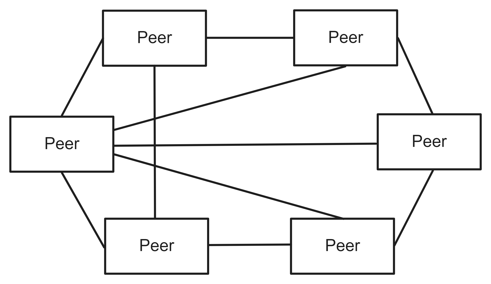

# Peer-to-Peer Architecture

## Pattern Description
The Peer-to-Peer (P2P) [^1][^2] Architecture characterizes a distributed architecture consisting of individual peers that collectively provide and use resources. All components are equally important and none are critical to the operation of the system.

The system has good scalability, but managing data consistency can be challenging due to the absence of a central control mechanism.
## Topology
The Peer-to-Peer Architecture is composed of multiple peers. In contrast to Client-Server Architecture, peers function as both a client and a server. Figure 1 illustrates how peers can communicate with one another.

**Figure 1:** The components of Peer-to-Peer Architecture and their possible communication.

**Peer** Peers offer their services and use the services of other peers. Communication between peers is conducted using a request/response protocol.

An individual peer can join or leave the system at any time. When a new peer is added, it discovers other peers with which it can interact. Subsequently, it can use their services. The process of finding a relevant peer is advertised through the surrounding peers.

## References
[^1]: LEN BASS Paul Clements, Rick Kazman. Software Architecture in Practice. 3rd ed. Pearson Education, 2013. isbn 978-0-321-81573-6.
[^2]: KANADE, Vijay. What Is Peer-To-Peer? Meaning, Features, Pros, and Cons [online]. Spiceworks, 2023-07-11 [visited on 2024-05- 10]. Available from: https : / / www . spiceworks . com / tech / networking/articles/what-is-peer-to-peer/.

