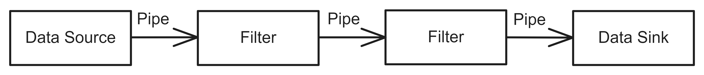
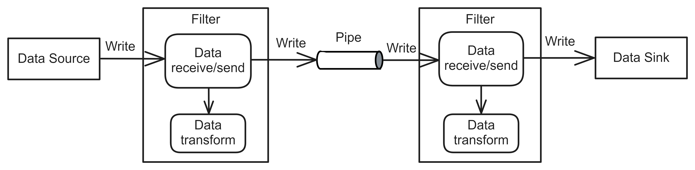

# Pipeline Architecture
## Pattern Description
The Pipeline Architecture [^1][^2], also known as Pipe and Filter Architecture, is a pattern that decomposes a task into subtasks that are executed sequentially. It is commonly used for data transformation and processing.

The system has several advantages, including component reusability, low cost, and simplicity. However, it is not fault tolerant and does not scale well.

## Topology
The Pipeline Architecture consists of Pipes, Filters, data Sources and Data Sinks. The Filter, Data Source, and Data Sink can be either active or passive. Figure 1 illustrates their interaction.

**Figure 1:** The components of Pipeline Architecture.

**Pipe** The Pipe is responsible for synchronizing the connection between Filters, Data Source and Filter, and Filter and Data Sink, using a queue when both components are active.  If one component is passive, the synchronization can be implemented as a direct call from the active to the passive component.

**Filter** The Filter is used to transform data. It receives input from the Pipe and modifies the output accordingly. The active Filter actively pulls the data, modifies it, and then pushes it to the next component. The passive Filter receives data from the active component and allows other components to receive the modified data at the output.  

**Data Source** The Data Source provides data input to the system. This could be a text file, for example. The active Data Source pushes data to the designated Filter, while the passive form enables the Filter to pull data from it.

**Data Sink** The Data Sink is responsible for collecting the resulting processed data. For instance, it can be either a file or a terminal that displays the output. Active Data Sinks download data actively, while Passive Data Sinks allow filters to write data to them. 

A Data Source provides initial data to the system, which is then passed via Pipe to Filter for conversion. The transformed data is subsequently passed through the Pipe to the next Filter. There can be any number of filters. Finally, the resulting processed data is placed in a Data Sink. Figure 2 illustrates this dynamic, demonstrating the unidirectional data flow that occurs most often.

**Figure 2:** An example of the communication between the components of Pipeline Architecture.
## References
[^1]: MARK RICHARDS, Neal Ford. Fundamentals of Software Architecture: An Engineering Approach. 1st ed. O’Reilly Media, Inc., 2020. isbn 978-1-492-04345-4.
[^2]: BUSCHMANN, Frank. Patten-Oriented Software Architecture: A System of Patterns. 1st ed. Wiley, 1996. isbn 0-471-95869-7.