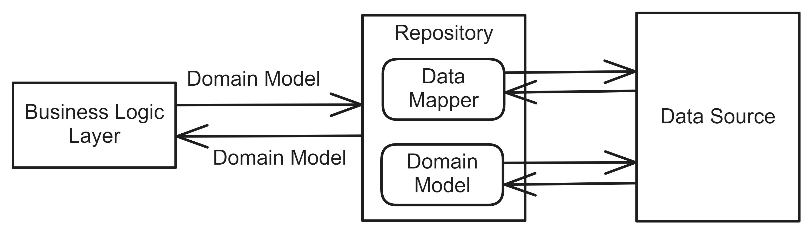
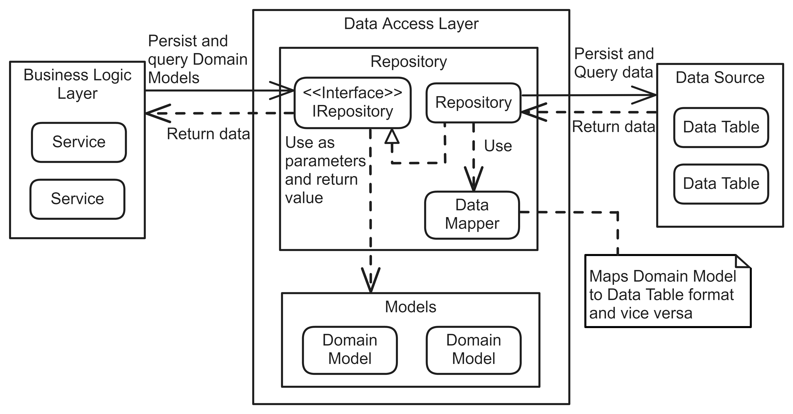

# Repository Patern
## Pattern Description
The Repository pattern [^1] provides an abstraction of data access. It allows the retrieval of data from the database in the form of domain objects, their manipulation in memory, and their subsequent storage back in the database. It defines interfaces for retrieving and modifying data. The implementation of these interfaces then contains the details of access to the data source.

The concealment of data access details affords enhanced maintainability and testability. Nevertheless, this approach introduces an additional layer of abstraction and may be less suitable for smaller applications.

## Topology
The Repository pattern provides access to data through an interface, which is implemented with specific details. The business logic code is then independent of these details. Figure 1 shows a typical view of the Repository pattern.

**Figure 1:** Repository pattern topology.

The provided interface contains methods for accessing data in the form of domain models. These methods typically include CRUD (create, read, update and delete) operations [^2]. The classes that implement these interfaces contain the logic for retrieving data from the data source. The input to this class is data in the form of a Domain Model, which must be converted to the format of the specific data source. This conversion is performed by a mapper. In the case of Entity Framework [^3], it is sufficient to implement the retrieval of data from the collection, for example, using LINQ [^4].

If a user makes a change to the application, the code in the business layer retrieves the relevant data through the repository. This data is then modified in memory according to the action. Finally, it is stored in the database via the repository. This dynamic is illustrated in Figure 2.

**Figure 2:** Detailed view on Repository pattern topology.

The number of defined repositories is not strictly defined. It is possible to define a separate repository for each table or a generic one. When designing models using Domain-Driven Design [^5], it is best-practice to define repositories only for aggregate roots [^5].

## References
[^1]: TORRE, Caesar de la. .NET Microservices: Architecture for Containerized .NET Applications. 7th ed. Microsoft Corporation.

[^2]: CRUD (create, read, update and delete) - definition & overview [online]. [visited on 2024-05-10]. Available from: https://www.sumologic.com/glossary/crud/.

[^3]: Entity Framework [online]. Microsoft, 2022-07-22 [visited on 2024-05-10]. Available from: https://learn.microsoft.com/en-us/aspnet/entity-framework.

[^4]: LINQ (Language Integrated Query) [online]. Microsoft, 2024-04-11 [visited on 2024-05-10]. Available from: https://learn.microsoft.com/cs-cz/dotnet/csharp/linq/.

[^5]: KHONONOV, Vlad. Learning Domain-Driven Design: Aligning Software Architecture and Business Strategy. O’Reilly Media, 2021. isbn 978-1-098-100100.