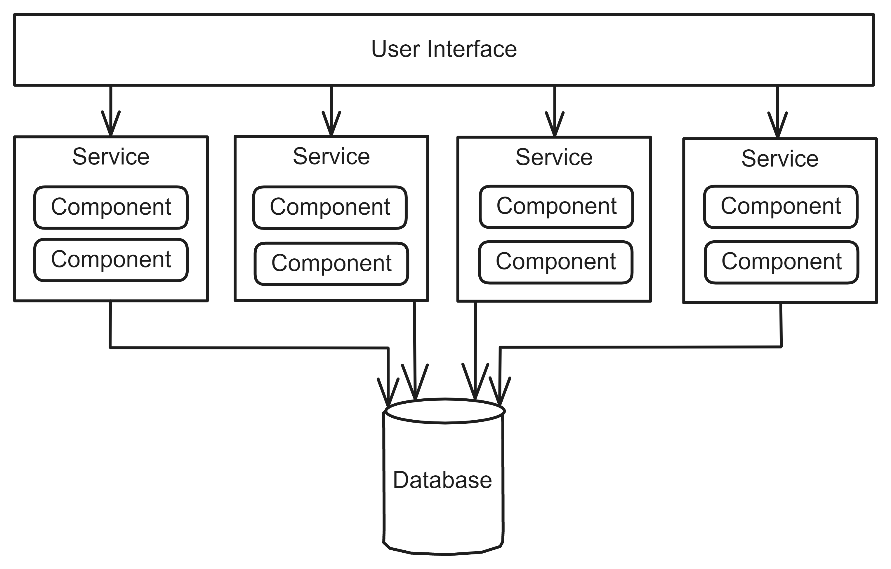

# Service-Oriented Architecture
## Pattern Description
The Service-Oriented Architecture (SOA) [^1] is a domain-partitioned and distributed architecture. It contains several coarse-grained services and only one database, which is shared by all services. Unlike other distributed architectures, it is not as comprehensive or costly. Therefore, it is relatively popular.

Using coarse-grained services improves data integrity and consistency. However, it is necessary to conduct more thorough testing as these services contain additional functionality that may be affected by changes. SOA exhibits a high level of modularity, and with coarse-grained services, there is no need for orchestration.

## Topology
The Service-Oriented Architecture can have many variations in its topology, making it a highly flexible architecture. The most basic form is illustrated in Figure 1, which includes a user interface, several services, and one database. The services are independent and can be scaled as needed. They are coarse-grained and typically number between 4 and 12, with 7 being the most common. The ACID principle is followed and database transactions ensure consistency within a single service. All services share one database. The database is structured in such a way that each service has a defined specific schema, but the data is stored in a shared database [^2]. It should be noted that services should not manipulate the data of another service. The user interface communicates directly with the services in its most basic form.

To avoid direct communication, an API layer can be added, as illustrated in Figure 2. The user interface communicates solely with the API layer, which queries data from each service and caches the received data.

**Figure 1:** The most basic form of Service-Oriented Architecture [^1].

The user interface can be divided into multiple sections to match different domains. It is possible to split a single database into multiple databases according to services. Example of multiple databases is shown in Figure 2.

**Figure 2:** Service-Oriented Architecture with API Layer and multiple databases.

The design of services is typically based on a Layered Architecture or Modular Monolith [^3], which always includes an API layer. Figure 3 illustrates an example of using the Layered Architecture. The user interface communicates solely with the API layer of the service. The API layer, in turn, communicates with the Business layer, followed by the Persistent layer, and finally the database.

**Figure 3:** The architecture of the service adheres to Layered Architecture.

Diagram 4 illustrates an example of a Service-Oriented Architecture in the form of a class diagram, specifically the Order service within the Ordering system. The *OrderController* class represents the input class for creating an order, which is then processed by a series of services, including those responsible for payment and item management within the warehouse.

**Figure 4:** An example of Service-Oriented Architecture captured in class diagram.

## Service-Oriented Architecture in Industry
In industry, Service-Oriented Architecture is commonly used as an intermediate step in the gradual transition from monolithic architecture to Microservices. The API layer is frequently employed in the communication of the user interface with services. This layer is often implemented using a facade or API Gateway.

As this architectural pattern is distributed, it is prone to the same issues as Microservices, such as dependencies between services. Further violations of Microservices can be found in separate section.

Issues frequently arise due to the shared database. In practice, sharing database schemas between services is common, and this can give rise to several complications. Multiple services may manipulate the same table and its data, but there is no assurance that these services will adhere to the same business rules for data manipulation. A common industry solution is to add logic in the form of a procedure to the database to handle this data, but this logic should be in the controller instead. This approach also reduces the maintainability of the system.

If the decision is made to remove these procedures from the database, a separate shared project is created, and this logic is moved to it. This project is then shared by multiple services and development teams. Sharing a single project between multiple teams can introduce some problems. For example, a team may implement a change to a~shared project that subsequently generates errors in another team's project that utilizes the shared project.

## References
[^1]: MARK RICHARDS, Neal Ford. Fundamentals of Software Architecture: An Engineering Approach. 1st ed. O’Reilly Media, Inc., 2020. isbn 978-1-492-04345-4.

[^2]: ERL, T. SOA Principles of Service Design. Pearson Education, 2007. The Prentice Hall Service Technology Series from Thomas Erl. isbn 9780132715836.

[^3]: NEWMAN, Sam. Building Microservices: Designing Fine-grained Systems. O’Reilly Media, 2021. isbn 9781492034025.